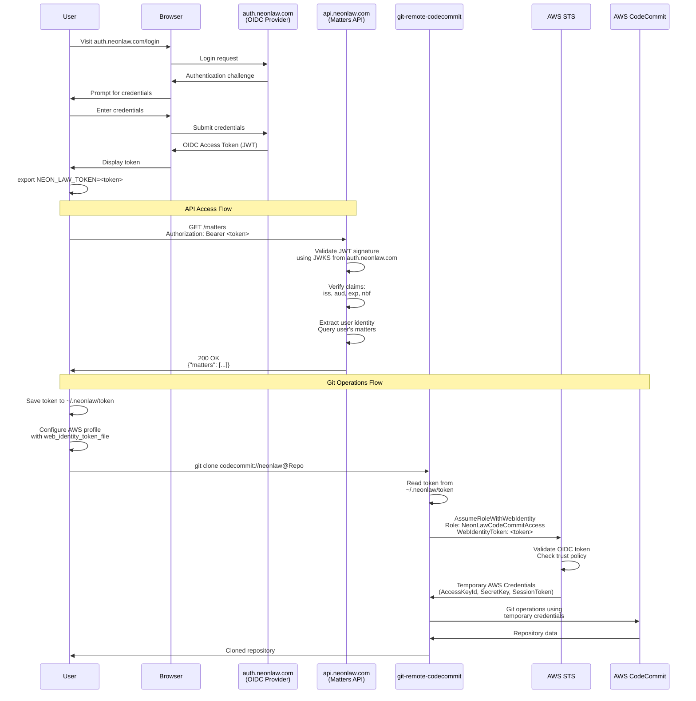

# Neon Law OIDC Authentication Flow

Single authentication system using OpenID Connect (OIDC) for both Matters API access and CodeCommit Git operations.

## High-Level Flow

```
User Authentication → auth.neonlaw.com (OIDC Provider)
                              ↓
                      OIDC Access Token
                              ↓
              ┌───────────────┴───────────────┐
              ↓                               ↓
    api.neonlaw.com                   git-remote-codecommit
    (Bearer Token)                            ↓
         ↓                          AWS STS AssumeRoleWithWebIdentity
         ↓                                    ↓
    Matters List                    Temporary AWS Credentials
                                              ↓
                                      CodeCommit Git Operations
                                      (clone, push, pull)
```

## Detailed Authentication Flow



## Component Diagram

```
┌─────────────────────────────────────────────────────────────────┐
│                        User Workstation                         │
│                                                                 │
│  ┌────────────────┐  ┌──────────────────┐  ┌────────────────┐ │
│  │ NEON_LAW_TOKEN │  │ ~/.neonlaw/token │  │ ~/.aws/config  │ │
│  │ (env var)      │→ │ (token file)     │← │ (profile cfg)  │ │
│  └────────────────┘  └──────────────────┘  └────────────────┘ │
│           ↓                   ↓                      ↓          │
│  ┌────────────────────────────────────────────────────────┐   │
│  │              git-remote-codecommit                      │   │
│  │  - Reads token from file                               │   │
│  │  - Calls AWS STS AssumeRoleWithWebIdentity             │   │
│  │  - Manages temporary credential lifecycle              │   │
│  └────────────────────────────────────────────────────────┘   │
└─────────────────────────────────────────────────────────────────┘
                              ↓
┌─────────────────────────────────────────────────────────────────┐
│                          AWS Cloud                              │
│                                                                 │
│  ┌──────────────────────────────────────────────────────────┐  │
│  │                 IAM OIDC Provider                        │  │
│  │  Provider: https://auth.neonlaw.com                      │  │
│  │  Client ID: neonlaw-matters-client                       │  │
│  │  Thumbprint: [SSL cert thumbprint]                      │  │
│  └──────────────────────────────────────────────────────────┘  │
│                              ↓                                  │
│  ┌──────────────────────────────────────────────────────────┐  │
│  │            IAM Role: NeonLawCodeCommitAccess             │  │
│  │                                                          │  │
│  │  Trust Policy:                                           │  │
│  │    Principal: Federated OIDC Provider                    │  │
│  │    Action: sts:AssumeRoleWithWebIdentity                 │  │
│  │    Condition: aud = neonlaw-matters-client               │  │
│  │                                                          │  │
│  │  Permissions:                                            │  │
│  │    - codecommit:GitPull                                  │  │
│  │    - codecommit:GitPush                                  │  │
│  │    - codecommit:ListRepositories                         │  │
│  │    - codecommit:GetRepository                            │  │
│  └──────────────────────────────────────────────────────────┘  │
│                              ↓                                  │
│  ┌──────────────────────────────────────────────────────────┐  │
│  │                   AWS CodeCommit                         │  │
│  │  - GreenCrossFarmacy                                     │  │
│  │  - ShookEstate                                           │  │
│  │  - [Other matter repositories]                           │  │
│  └──────────────────────────────────────────────────────────┘  │
└─────────────────────────────────────────────────────────────────┘
                              ↑
┌─────────────────────────────────────────────────────────────────┐
│                   Neon Law Infrastructure                       │
│                                                                 │
│  ┌──────────────────────────────────────────────────────────┐  │
│  │              auth.neonlaw.com (OIDC Provider)            │  │
│  │  - User authentication                                   │  │
│  │  - Token issuance                                        │  │
│  │  - JWKS endpoint (/.well-known/jwks.json)                │  │
│  │  - Discovery (/.well-known/openid-configuration)         │  │
│  └──────────────────────────────────────────────────────────┘  │
│                                                                 │
│  ┌──────────────────────────────────────────────────────────┐  │
│  │              api.neonlaw.com/matters                     │  │
│  │  - Validates OIDC Bearer token                           │  │
│  │  - Queries user's accessible matters                     │  │
│  │  - Returns repository list                               │  │
│  └──────────────────────────────────────────────────────────┘  │
└─────────────────────────────────────────────────────────────────┘
```

## Token Structure

### OIDC Access Token (JWT)

**Header:**

```json
{
  "alg": "RS256",
  "kid": "<key-id>",
  "typ": "JWT"
}
```

**Payload:**

```json
{
  "iss": "https://auth.neonlaw.com",
  "sub": "user-unique-identifier",
  "aud": "neonlaw-matters-client",
  "exp": 1735171200,
  "nbf": 1735167600,
  "iat": 1735167600,
  "email": "attorney@neonlaw.com",
  "scope": "matters:read openid profile email"
}
```

**Signature:**

```
RS256(base64UrlEncode(header) + "." + base64UrlEncode(payload), privateKey)
```

## AWS Profile Configuration

**File:** `~/.aws/config`

```ini
[profile neonlaw]
role_arn = arn:aws:iam::731099197338:role/NeonLawCodeCommitAccess
web_identity_token_file = ~/.neonlaw/token
role_session_name = neonlaw-user
region = us-west-2
```

## Setup Workflow

```
1. User Setup
   ├─ Install git-remote-codecommit
   │  └─ pip install git-remote-codecommit
   │
   ├─ Authenticate with OIDC Provider
   │  ├─ Visit https://auth.neonlaw.com/login
   │  ├─ Enter credentials
   │  └─ Receive OIDC access token
   │
   ├─ Save Token
   │  ├─ export NEON_LAW_TOKEN=<token>
   │  └─ Run ~/.standards/setup.sh
   │
   └─ Setup Script Actions
      ├─ Save token to ~/.neonlaw/token
      ├─ Configure ~/.aws/config profile
      ├─ Call api.neonlaw.com/matters
      │  └─ Get list of accessible repositories
      │
      └─ Clone repositories
         └─ git clone codecommit://neonlaw@<repo> ~/Standards/<repo>

2. Git Operations
   ├─ User runs: git clone/push/pull
   │
   ├─ git-remote-codecommit intercepts
   │  ├─ Reads ~/.neonlaw/token
   │  ├─ Calls AssumeRoleWithWebIdentity
   │  └─ Receives temporary AWS credentials
   │
   └─ Git operation proceeds with temp credentials

3. Token Expiration (typically 1 hour)
   ├─ OIDC token expires
   │
   ├─ User re-authenticates
   │  ├─ Visit auth.neonlaw.com/login
   │  └─ Obtain new token
   │
   └─ Update token file
      ├─ echo $NEW_TOKEN > ~/.neonlaw/token
      └─ git-remote-codecommit uses new token on next operation
```

## Security Flow

```
┌─────────────────────────────────────────────────────────────┐
│                    Security Validation                      │
└─────────────────────────────────────────────────────────────┘

1. OIDC Token Validation (by api.neonlaw.com)
   ├─ Fetch JWKS from auth.neonlaw.com/.well-known/jwks.json
   ├─ Verify signature using public key from JWKS
   ├─ Validate issuer: "iss" === "https://auth.neonlaw.com"
   ├─ Validate audience: "aud" === "neonlaw-matters-client"
   ├─ Validate expiration: "exp" > current_time
   ├─ Validate not-before: "nbf" <= current_time
   └─ Extract user identity from "sub" or "email" claim

2. AWS STS Validation (AssumeRoleWithWebIdentity)
   ├─ Verify token signature against OIDC provider
   ├─ Check trust policy on NeonLawCodeCommitAccess role
   │  ├─ Federated: arn:aws:iam::...:oidc-provider/auth.neonlaw.com
   │  └─ Condition: auth.neonlaw.com:aud = neonlaw-matters-client
   ├─ Validate token not expired
   ├─ Issue temporary credentials
   │  ├─ AccessKeyId
   │  ├─ SecretAccessKey
   │  └─ SessionToken
   └─ Credentials valid for 1 hour (default)

3. CodeCommit Authorization
   ├─ Receives git operation with temp credentials
   ├─ Validates credentials with AWS STS
   ├─ Checks IAM permissions on assumed role
   │  └─ NeonLawCodeCommitAccess has codecommit:GitPull/GitPush
   ├─ Verifies resource access
   │  └─ Resource: arn:aws:codecommit:us-west-2:731099197338:*
   └─ Allow or deny operation
```

## Error Handling

### Common Error Scenarios

**1. Expired OIDC Token**

```
Error: Token has expired
Solution: Re-authenticate at auth.neonlaw.com/login
```

**2. Invalid Token Audience**

```
Error: Token audience 'wrong-client' does not match expected 'neonlaw-matters-client'
Solution: Ensure token is obtained for correct client application
```

**3. git-remote-codecommit Not Installed**

```
Error: git-remote-codecommit: command not found
Solution: pip install git-remote-codecommit
```

**4. Token File Not Found**

```
Error: Unable to locate credentials
Solution: Save token to ~/.neonlaw/token or set NEON_LAW_TOKEN
```

**5. AWS Profile Not Configured**

```
Error: Profile 'neonlaw' not found
Solution: Run setup.sh or manually configure ~/.aws/config
```

## Credential Lifecycle

```
OIDC Token Lifecycle:
├─ Issue: User authenticates at auth.neonlaw.com
├─ Lifetime: 1 hour (typical)
├─ Storage: ~/.neonlaw/token
├─ Usage:
│  ├─ Direct: api.neonlaw.com (Bearer header)
│  └─ Exchange: AWS STS AssumeRoleWithWebIdentity
└─ Expiration: User must re-authenticate

AWS Temporary Credentials Lifecycle:
├─ Issue: AWS STS AssumeRoleWithWebIdentity
├─ Lifetime: 1 hour (configurable)
├─ Storage: In-memory by git-remote-codecommit
├─ Usage: CodeCommit Git operations
├─ Refresh: Automatic on next git operation if OIDC token valid
└─ Expiration: Re-assumed automatically if OIDC token still valid
```

## Comparison: Old vs New Authentication

### Old Architecture (Dual Authentication)

```
┌──────────────────────┐     ┌──────────────────────┐
│  OIDC Token          │     │  AWS IAM User        │
│  (for API only)      │     │  (for Git only)      │
└──────────────────────┘     └──────────────────────┘
         ↓                            ↓
┌──────────────────────┐     ┌──────────────────────┐
│  api.neonlaw.com     │     │  AWS CodeCommit      │
│  GET /matters        │     │  git clone/push/pull │
└──────────────────────┘     └──────────────────────┘

Problems:
- Two separate authentication systems
- IAM user credentials stored in Keychain
- Static credentials (security risk)
- Manual credential rotation required
```

### New Architecture (Single OIDC)

```
┌────────────────────────────────────┐
│  OIDC Token                        │
│  (for both API and Git)            │
└────────────────────────────────────┘
         ↓               ↓
┌──────────────┐  ┌────────────────────────┐
│ api.neonlaw  │  │  AWS STS               │
│ /matters     │  │  AssumeRoleWithWebId   │
└──────────────┘  └────────────────────────┘
                           ↓
                  ┌────────────────────────┐
                  │  AWS CodeCommit        │
                  │  (temp credentials)    │
                  └────────────────────────┘

Benefits:
- Single authentication point
- No static credentials
- Automatic credential rotation
- Temporary credentials only
- Centralized access control
```

## References

- [AWS OIDC Identity Providers](https://docs.aws.amazon.com/IAM/latest/UserGuide/id_roles_providers_create_oidc.html)
- [AssumeRoleWithWebIdentity API](https://docs.aws.amazon.com/STS/latest/APIReference/API_AssumeRoleWithWebIdentity.html)
- [CodeCommit with Temporary Credentials](https://docs.aws.amazon.com/codecommit/latest/userguide/temporary-access.html)
- [git-remote-codecommit Documentation](https://docs.aws.amazon.com/codecommit/latest/userguide/setting-up-git-remote-codecommit.html)
- [OpenID Connect Specification](https://openid.net/specs/openid-connect-core-1_0.html)
- [JWT Token Format](https://jwt.io/)
