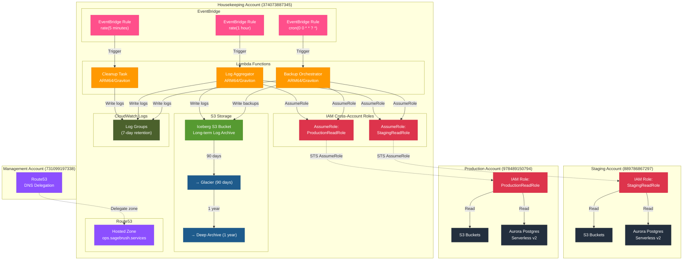

# Housekeeping Account Architecture (374073887345)

The Housekeeping account provides operational tooling, scheduled maintenance tasks, log aggregation, and
cross-account monitoring for Staging and Production environments.

## Architecture Diagram

## Key Resources

### EventBridge Rules

- **5-minute rule**: Cleanup tasks, health checks, metric collection
- **Hourly rule**: Log aggregation from Staging/Production CloudWatch Logs
- **Daily rule**: Database backup orchestration, cost reporting
- **Reference**:
  [EventBridge Schedule Expressions](https://docs.aws.amazon.com/eventbridge/latest/userguide/eb-create-rule-schedule.html)

### Lambda Functions (ARM64/Graviton)

- **Log Aggregator**: Pulls CloudWatch Logs from Staging/Production → Writes to Iceberg S3
- **Backup Orchestrator**: Creates RDS snapshots, copies to Iceberg S3
- **Cleanup Task**: Removes old resources, optimizes storage costs
- **Architecture**: All functions use ARM64 for better price/performance
- **Reference**:
  [Lambda with Graviton2](https://aws.amazon.com/blogs/aws/aws-lambda-functions-powered-by-aws-graviton2-processor-run-your-functions-on-arm-and-get-up-to-34-better-price-performance/)

### Iceberg S3 Bucket (Long-term Archive)

- **Purpose**: Centralized long-term storage for logs and backups
- **Lifecycle Policy**:
  - Current objects → Glacier Flexible Retrieval (90 days)
  - Glacier → Deep Archive (1 year)
  - Old versions → Glacier (30 days) → Deep Archive (90 days) → Delete (2 years)
- **Cost Optimization**: Deep Archive is ~95% cheaper than S3 Standard
- **Reference**: [S3 Glacier Storage Classes](https://aws.amazon.com/s3/storage-classes/glacier/)

### Cross-Account Access (IAM AssumeRole)

- **Pattern**: Lambda functions assume roles in Staging/Production accounts
- **Permissions**: Read-only access to S3 and RDS (list buckets, describe DB instances)
- **Trust Policy**: Staging/Production accounts trust Housekeeping account ID (374073887345)
- **Security**: No long-term credentials, only temporary STS tokens
- **Reference**:
  [Cross-Account Access with IAM Roles](https://docs.aws.amazon.com/IAM/latest/UserGuide/tutorial_cross-account-with-roles.html)

### Route53 Hosted Zone

- **Zone**: ops.sagebrush.services
- **Purpose**: Internal operational dashboards, monitoring endpoints
- **Delegation**: DNS zone delegated from Management account

## Design Rationale

### Why Housekeeping Account?

Separating operational tooling from workload accounts provides:

- **Security isolation**: Backup/monitoring tools can't be disrupted by application failures
- **Cost visibility**: Clear separation of operational vs application costs
- **Access control**: Different teams can manage operations vs applications
- **Reference**:
  [AWS Multi-Account Strategy](https://docs.aws.amazon.com/whitepapers/latest/organizing-your-aws-environment/organizing-your-aws-environment.html)

### Why Iceberg (Long-term S3)?

Centralizing log storage with Glacier transitions:

- **Compliance**: Meet regulatory requirements for log retention (7+ years)
- **Cost optimization**: Glacier Deep Archive costs ~$0.00099/GB/month vs $0.023/GB for S3 Standard
- **Disaster recovery**: Independent backup storage if production account is compromised
- **Reference**:
  [S3 Lifecycle Best Practices](https://docs.aws.amazon.com/AmazonS3/latest/userguide/lifecycle-transition-general-considerations.html)

### Why Cross-Account Read Access?

AssumeRole pattern for accessing Staging/Production:

- **Principle of least privilege**: Read-only access, can't modify production
- **Audit trail**: Every cross-account access is logged in CloudTrail
- **No shared credentials**: Temporary STS tokens expire automatically
- **Reference**:
  [STS AssumeRole Best Practices](https://docs.aws.amazon.com/IAM/latest/UserGuide/best-practices.html#bp-workloads-use-roles)

## Data Flow

1. **Scheduled Events**: EventBridge rule triggers → Lambda function invoked
2. **Cross-Account Access**: Lambda AssumeRole in Staging/Production → Temporary STS credentials
   obtained
3. **Data Collection**: Lambda reads from Staging/Production S3/RDS → Processes data
4. **Log Archival**: Lambda writes logs to Iceberg S3 → Lifecycle policy transitions to Glacier
5. **Cost Optimization**: After 90 days → Glacier Flexible Retrieval, After 1 year → Deep Archive
