# Management Account Architecture (731099197338)

The Management account is dedicated to AWS Organizations configuration and DNS management. It does not run application workloads.

## Architecture Diagram

```mermaid
graph TB
    subgraph Management["Management Account (731099197338)"]
        subgraph Route53["Route53"]
            HZ1["Hosted Zone<br/>sagebrush.services"]
            HZ2["Hosted Zone<br/>neonlaw.com"]
            HZ3["Hosted Zone<br/>Other domains"]
        end

        subgraph Organizations["AWS Organizations"]
            ORG["Organization Root"]
            BILLING["Consolidated Billing"]
            SCP["Service Control Policies"]
        end

        subgraph IAM["Identity & Access"]
            CLI_USER["SagebrushCLI IAM User"]
            ASSUME_ROLE["STS AssumeRole<br/>Permissions"]
        end
    end

    subgraph External["External Dependencies"]
        REGISTRAR["Domain Registrar<br/>(Update NS records)"]
        DNS_CLIENT["DNS Clients<br/>(Public Internet)"]
    end

    subgraph MemberAccounts["Member Accounts"]
        PROD["Production<br/>(978489150794)"]
        STAGING["Staging<br/>(889786867297)"]
        HOUSEKEEPING["Housekeeping<br/>(374073887345)"]
        NEONLAW["NeonLaw<br/>(102186460229)"]
    end

    %% DNS Flow
    DNS_CLIENT -->|DNS Query| HZ1
    DNS_CLIENT -->|DNS Query| HZ2
    REGISTRAR -.->|Configure NS records| HZ1
    REGISTRAR -.->|Configure NS records| HZ2

    %% Organizations relationships
    ORG --> PROD
    ORG --> STAGING
    ORG --> HOUSEKEEPING
    ORG --> NEONLAW
    BILLING --> PROD
    BILLING --> STAGING
    BILLING --> HOUSEKEEPING
    BILLING --> NEONLAW

    %% Cross-account access
    CLI_USER -->|AssumeRole| ASSUME_ROLE
    ASSUME_ROLE -.->|STS AssumeRole| PROD
    ASSUME_ROLE -.->|STS AssumeRole| STAGING
    ASSUME_ROLE -.->|STS AssumeRole| HOUSEKEEPING
    ASSUME_ROLE -.->|STS AssumeRole| NEONLAW

    classDef route53 fill:#8C4FFF,stroke:#7B3FEF,color:#fff
    classDef org fill:#FF9900,stroke:#E88500,color:#fff
    classDef iam fill:#DD344C,stroke:#CC2340,color:#fff
    classDef external fill:#7D8B8F,stroke:#6D7B7F,color:#fff
    classDef account fill:#232F3E,stroke:#1A252F,color:#fff

    class HZ1,HZ2,HZ3 route53
    class ORG,BILLING,SCP org
    class CLI_USER,ASSUME_ROLE iam
    class REGISTRAR,DNS_CLIENT external
    class PROD,STAGING,HOUSEKEEPING,NEONLAW account
```

## Key Resources

### Route53 Hosted Zones

- **Purpose**: Centralized DNS management for all domains
- **Domains**: sagebrush.services, neonlaw.com, and other organizational domains
- **DNS Records**: Delegated to individual accounts for their respective services
- **Reference**: [Route53 Hosted Zones](https://docs.aws.amazon.com/Route53/latest/DeveloperGuide/hosted-zones-working-with.html)

### AWS Organizations

- **Purpose**: Multi-account governance and consolidated billing
- **Member Accounts**: 4 member accounts (Production, Staging, Housekeeping, NeonLaw)
- **Billing**: All charges consolidated into Management account
- **Reference**: [AWS Organizations Best Practices](https://docs.aws.amazon.com/organizations/latest/userguide/orgs_best-practices.html)

### IAM Cross-Account Access

- **SagebrushCLI User**: IAM user with `sts:AssumeRole` permission
- **AssumeRole Pattern**: Single set of credentials assumes roles in all 5 accounts
- **Security**: MFA can be enforced on the Management account IAM user
- **Reference**: [Cross-Account Access with IAM Roles](https://docs.aws.amazon.com/IAM/latest/UserGuide/tutorial_cross-account-with-roles.html)

## Design Rationale

### Why Route53 in Management?

According to AWS best practices, DNS should be centralized in the Management account:

- **Single source of truth**: One place to manage all domain DNS records
- **Disaster recovery**: DNS remains accessible even if a workload account is compromised
- **Delegation**: Individual accounts can create records in their hosted zones
- **Reference**: [AWS Organizations - DNS Considerations](https://docs.aws.amazon.com/whitepapers/latest/organizing-your-aws-environment/dns.html)

### Why No Workloads?

The Management account should never run application workloads:

- **Security isolation**: Protects billing and organization configuration
- **Blast radius**: Compromised workload can't affect organization-wide settings
- **Compliance**: Easier to audit and maintain compliance certifications
- **Reference**: [AWS Well-Architected - Security Pillar](https://docs.aws.amazon.com/wellarchitected/latest/security-pillar/sec_identities_permissions.html)

## Data Flow

1. **DNS Resolution**: Public DNS clients query Route53 hosted zones → Route53 returns authoritative answers
2. **Cross-Account CLI Access**: CLI user authenticates → STS AssumeRole → Temporary credentials for target account
3. **Billing Aggregation**: All member account charges → Consolidated into Management account bill
