# NeonLaw Account Architecture (102186460229)

The NeonLaw account is dedicated to NeonLaw application infrastructure, isolated from other Sagebrush
services for security and billing separation.

## Architecture Diagram

```mermaid
graph TB
    subgraph NeonLaw["NeonLaw Account (102186460229)"]
        subgraph VPC["VPC (10.12.0.0/16)"]
            subgraph PublicSubnets["Public Subnets"]
                PUB_1A["Public Subnet<br/>10.12.0.0/24<br/>us-west-2a"]
                PUB_1B["Public Subnet<br/>10.12.1.0/24<br/>us-west-2b"]
            end

            subgraph PrivateSubnets["Private Subnets"]
                PRIV_1A["Private Subnet<br/>10.12.10.0/24<br/>us-west-2a"]
                PRIV_1B["Private Subnet<br/>10.12.11.0/24<br/>us-west-2b"]
            end

            IGW["Internet Gateway"]
            NAT["NAT Gateway"]
        end

        subgraph Compute["Compute"]
            subgraph Lambda["Lambda Functions"]
                LAMBDA_API["Legal API Handler<br/>ARM64/Graviton"]
                LAMBDA_DOCUMENT["Document Processor<br/>ARM64/Graviton"]
                LAMBDA_NOTIFICATION["Notification Service<br/>ARM64/Graviton"]
            end

            subgraph ECS["ECS Fargate"]
                ECS_CLUSTER["ECS Cluster<br/>neonlaw-cluster"]
                ECS_SERVICE["ECS Service<br/>NeonLaw Web App<br/>Min: 2, Max: 10 tasks"]
                ECS_TASK["Task Definition<br/>Fargate<br/>1 vCPU, 2 GB"]
            end
        end

        subgraph LoadBalancing["Load Balancing & API"]
            ALB["Application Load Balancer<br/>www.neonlaw.com"]
            ALB_TG["Target Group<br/>IP targets"]
            APIGW["API Gateway<br/>Legal Services API"]
        end

        subgraph DNS_SSL["DNS & SSL"]
            R53_ZONE["Route53 Hosted Zone<br/>neonlaw.com"]
            ACM_CERT["ACM Certificate<br/>*.neonlaw.com"]
        end

        subgraph Database["Database"]
            RDS["Aurora Postgres<br/>Serverless v2<br/>Legal case data"]
            RDS_SUBNET["DB Subnet Group"]
            RDS_SG["Security Group"]
        end

        subgraph Storage["S3 Storage"]
            S3_ASSETS["S3: neonlaw-assets<br/>Public legal resources"]
            S3_DOCUMENTS["S3: neonlaw-documents<br/>Legal documents (encrypted)"]
            S3_BACKUPS["S3: neonlaw-backups<br/>Versioned backups"]
        end

        subgraph Monitoring["Monitoring"]
            CW_LOGS["CloudWatch Logs<br/>30-day retention"]
            CW_METRICS["CloudWatch Metrics<br/>Legal service KPIs"]
            CW_ALARMS["CloudWatch Alarms<br/>SNS notifications"]
        end

        subgraph Security["Security & Compliance"]
            SECRETS["Secrets Manager<br/>DB credentials<br/>API keys"]
            KMS["KMS Keys<br/>Document encryption"]
        end

        subgraph IAM_NeonLaw["IAM Roles"]
            ROLE_EXEC["ECS Task Execution Role"]
            ROLE_TASK["ECS Task Role"]
            ROLE_LAMBDA["Lambda Execution Role"]
        end
    end

    subgraph Internet["Internet"]
        LEGAL_CLIENTS["Legal Professionals<br/>(HTTPS traffic)"]
        PUBLIC_USERS["Public Users<br/>(Legal resources)"]
        API_INTEGRATIONS["Third-Party Legal APIs<br/>(Court systems, etc.)"]
    end

    subgraph Management["Management Account (731099197338)"]
        MGMT_R53["Route53<br/>DNS Delegation"]
    end

    subgraph External["External Services"]
        COURT_API["Court Filing APIs<br/>(PACER, ECF)"]
        DOCUSIGN["DocuSign API<br/>(E-signatures)"]
        STRIPE["Stripe API<br/>(Payments)"]
    end

    %% Internet traffic flow
    LEGAL_CLIENTS -->|HTTPS| ALB
    PUBLIC_USERS -->|HTTPS| ALB
    API_INTEGRATIONS -->|HTTPS| APIGW

    %% ALB to ECS
    ALB -->|Forward| ALB_TG
    ALB_TG -->|Route| ECS_SERVICE
    ECS_SERVICE -->|Run| ECS_TASK

    %% API Gateway to Lambda
    APIGW -->|Invoke| LAMBDA_API

    %% Lambda functions to services
    LAMBDA_API -->|Query| RDS
    LAMBDA_API -->|Read/Write| S3_DOCUMENTS
    LAMBDA_DOCUMENT -->|Process| S3_DOCUMENTS
    LAMBDA_DOCUMENT -->|Encrypt with| KMS
    LAMBDA_NOTIFICATION -->|Send emails| External

    %% ECS Task to RDS and S3
    ECS_TASK -->|Query| RDS
    ECS_TASK -->|Read/Write| S3_DOCUMENTS
    ECS_TASK -->|Read| S3_ASSETS
    ECS_TASK -->|Decrypt with| KMS

    %% External integrations
    LAMBDA_API -->|File documents| COURT_API
    LAMBDA_API -->|Send for signature| DOCUSIGN
    LAMBDA_API -->|Process payments| STRIPE

    %% DNS and SSL
    MGMT_R53 -.->|Delegate zone| R53_ZONE
    R53_ZONE -->|A record| ALB
    ACM_CERT -.->|TLS termination| ALB

    %% VPC networking
    IGW -->|Route| PUB_1A
    IGW -->|Route| PUB_1B
    NAT -->|NAT| PRIV_1A
    NAT -->|NAT| PRIV_1B
    PUB_1A -.->|Hosts| ALB
    PRIV_1A -.->|Hosts| ECS_TASK
    PRIV_1A -.->|Hosts| RDS

    %% Database subnet
    RDS_SUBNET -.->|Spans| PRIV_1A
    RDS_SUBNET -.->|Spans| PRIV_1B

    %% Monitoring
    ECS_TASK -->|Logs| CW_LOGS
    LAMBDA_API -->|Logs| CW_LOGS
    LAMBDA_DOCUMENT -->|Logs| CW_LOGS
    LAMBDA_NOTIFICATION -->|Logs| CW_LOGS
    ECS_TASK -->|Metrics| CW_METRICS
    LAMBDA_API -->|Metrics| CW_METRICS
    CW_METRICS -->|Trigger| CW_ALARMS

    %% Secrets
    ECS_TASK -.->|Fetch secrets| SECRETS
    LAMBDA_API -.->|Fetch secrets| SECRETS

    %% Backups
    S3_DOCUMENTS -.->|Versioning| S3_BACKUPS

    %% IAM role assignments
    ROLE_EXEC -.->|Used by| ECS_TASK
    ROLE_TASK -.->|Used by| ECS_TASK
    ROLE_LAMBDA -.->|Used by| LAMBDA_API
    ROLE_LAMBDA -.->|Used by| LAMBDA_DOCUMENT
    ROLE_LAMBDA -.->|Used by| LAMBDA_NOTIFICATION

    classDef vpc fill:#FF9900,stroke:#E88500,color:#fff
    classDef compute fill:#FF9900,stroke:#E88500,color:#fff
    classDef alb fill:#8C4FFF,stroke:#7B3FEF,color:#fff
    classDef route53 fill:#8C4FFF,stroke:#7B3FEF,color:#fff
    classDef rds fill:#3F8624,stroke:#2F7614,color:#fff
    classDef s3 fill:#569A31,stroke:#478521,color:#fff
    classDef lambda fill:#FF9900,stroke:#E88500,color:#fff
    classDef monitoring fill:#4B612C,stroke:#3B512C,color:#fff
    classDef security fill:#DD344C,stroke:#CC2340,color:#fff
    classDef iam fill:#DD344C,stroke:#CC2340,color:#fff
    classDef internet fill:#7D8B8F,stroke:#6D7B7F,color:#fff
    classDef external fill:#146EB4,stroke:#0E5E94,color:#fff

    class PUB_1A,PUB_1B,PRIV_1A,PRIV_1B,IGW,NAT vpc
    class ECS_CLUSTER,ECS_SERVICE,ECS_TASK compute
    class ALB,ALB_TG,APIGW alb
    class R53_ZONE,ACM_CERT,MGMT_R53 route53
    class RDS,RDS_SUBNET,RDS_SG rds
    class S3_ASSETS,S3_DOCUMENTS,S3_BACKUPS s3
    class LAMBDA_API,LAMBDA_DOCUMENT,LAMBDA_NOTIFICATION lambda
    class CW_LOGS,CW_METRICS,CW_ALARMS monitoring
    class SECRETS,KMS security
    class ROLE_EXEC,ROLE_TASK,ROLE_LAMBDA iam
    class LEGAL_CLIENTS,PUBLIC_USERS,API_INTEGRATIONS internet
    class COURT_API,DOCUSIGN,STRIPE external
```

## Key Resources

### VPC and Networking

- **CIDR Block**: 10.12.0.0/16 (Class B = 12 for NeonLaw)
- **Public Subnets**: 2 subnets across 2 AZs (us-west-2a, us-west-2b) for ALB
- **Private Subnets**: 2 subnets across 2 AZs for ECS tasks and RDS
- **NAT Gateway**: Allows private subnet resources to access external APIs (court systems, DocuSign,
  etc.)
- **Reference**:
  [VPC with Public and Private Subnets](https://docs.aws.amazon.com/vpc/latest/userguide/VPC_Scenario2.html)

### Compute - ECS Fargate (NeonLaw Web App)

- **Cluster**: neonlaw-cluster
- **Service**: Auto-scaling web application (min: 2, max: 10 tasks)
- **Task Definition**: Fargate, 1 vCPU, 2 GB memory
- **Container**: NeonLaw web application (case management, client portal)
- **Reference**:
  [ECS Service Auto Scaling](https://docs.aws.amazon.com/AmazonECS/latest/developerguide/service-auto-scaling.html)

### Compute - Lambda Functions (Legal Services)

- **Legal API Handler**: REST API for legal services (case search, document retrieval)
- **Document Processor**: PDF generation, document parsing, OCR
- **Notification Service**: Email/SMS notifications for case updates, deadlines
- **Architecture**: ARM64/Graviton for better price/performance
- **Reference**:
  [Lambda Use Cases](https://docs.aws.amazon.com/lambda/latest/dg/applications-usecases.html)

### Application Load Balancer

- **Domain**: <www.neonlaw.com>
- **Listeners**: HTTPS:443 (ACM certificate), HTTP:80 (redirect to HTTPS)
- **Target Group**: IP targets (for Fargate tasks)
- **Health Checks**: HTTP /health endpoint
- **Reference**:
  [ALB Best Practices](https://docs.aws.amazon.com/elasticloadbalancing/latest/application/application-load-balancers.html)

### API Gateway (Legal Services API)

- **Type**: REST API for third-party integrations
- **Endpoints**: `/cases`, `/documents`, `/clients`, `/billing`
- **Authorization**: API key + IAM authentication
- **Usage Plans**: Rate limiting per client
- **Reference**:
  [API Gateway REST API](https://docs.aws.amazon.com/apigateway/latest/developerguide/apigateway-rest-api.html)

### Route53 & ACM

- **Hosted Zone**: neonlaw.com (delegated from Management account)
- **A Record**: <www.neonlaw.com> → ALB DNS name
- **ACM Certificate**: *.neonlaw.com (wildcard)
- **Validation**: DNS validation via Route53
- **Reference**:
  [ACM DNS Validation](https://docs.aws.amazon.com/acm/latest/userguide/dns-validation.html)

### Aurora Postgres Serverless v2 (Legal Data)

- **Engine**: PostgreSQL 15
- **Capacity**: Min 0.5 ACU, Max 2 ACU (auto-scaling)
- **Schema**: Cases, clients, documents, billing, court deadlines
- **Backups**: Automated daily snapshots, 30-day retention
- **Encryption**: At-rest (KMS), in-transit (SSL/TLS)
- **Compliance**: Data encrypted for attorney-client privilege
- **Reference**:
  [Aurora Serverless v2](https://docs.aws.amazon.com/AmazonRDS/latest/AuroraUserGuide/aurora-serverless-v2.html)

### S3 Buckets (Legal Documents)

- **neonlaw-assets**: Public bucket for legal resources (blog posts, forms, guides)
- **neonlaw-documents**: Private bucket for client legal documents (complaints, contracts, briefs)
- **neonlaw-backups**: Versioned backups with cross-region replication
- **Encryption**: Server-side encryption with KMS customer-managed keys
- **Versioning**: Enabled for audit trail and compliance
- **Lifecycle**: Old versions → Glacier (90 days) → Deep Archive (1 year)
- **Reference**:
  [S3 Security Best Practices](https://docs.aws.amazon.com/AmazonS3/latest/userguide/security-best-practices.html)

### Security & Compliance

- **KMS Customer-Managed Keys**: Encrypt legal documents at rest
- **Secrets Manager**: Store database credentials, API keys for external services
- **VPC Security Groups**: Restrict database access to application tier only
- **IAM Least Privilege**: Separate roles for ECS task execution vs runtime
- **Audit Trail**: CloudTrail logs all API calls for compliance
- **Reference**: [AWS Compliance Programs](https://aws.amazon.com/compliance/programs/)

### External Integrations

- **Court Filing APIs**: PACER, ECF (Electronic Case Filing)
- **DocuSign**: E-signature for legal documents
- **Stripe**: Payment processing for legal services
- **Reference**:
  [Lambda External Service Integration](https://docs.aws.amazon.com/lambda/latest/dg/lambda-services.html)

## Design Rationale

### Why Separate NeonLaw Account?

Dedicated account for NeonLaw provides:

- **Security isolation**: Legal data separated from other Sagebrush services
- **Compliance**: Easier to audit and maintain legal compliance certifications
- **Billing transparency**: Clear cost attribution for NeonLaw vs Sagebrush
- **Access control**: Different teams and permissions for legal vs general services
- **Reference**:
  [AWS Multi-Account Strategy](https://docs.aws.amazon.com/whitepapers/latest/organizing-your-aws-environment/organizing-your-aws-environment.html)

### Why KMS Customer-Managed Keys?

Legal documents require strong encryption controls:

- **Attorney-client privilege**: Client documents must be encrypted at rest
- **Key rotation**: Automatic annual key rotation for security
- **Access control**: Fine-grained IAM policies on who can decrypt documents
- **Audit trail**: CloudTrail logs every encryption/decryption operation
- **Reference**:
  [KMS Best Practices](https://docs.aws.amazon.com/kms/latest/developerguide/best-practices.html)

### Why Document Versioning?

Legal industry requires comprehensive audit trails:

- **Regulatory compliance**: Bar associations require document retention
- **Litigation protection**: Immutable audit trail for malpractice defense
- **Client transparency**: Clients can see document history
- **Reference**:
  [S3 Object Versioning](https://docs.aws.amazon.com/AmazonS3/latest/userguide/Versioning.html)

### Why External API Integrations?

Modern legal practice requires system integrations:

- **Court filing**: Electronic filing to federal/state courts (PACER, ECF)
- **E-signatures**: DocuSign for remote client signatures
- **Payments**: Stripe for secure payment processing
- **Efficiency**: Automation reduces manual data entry and errors
- **Reference**:
  [Lambda Integration Patterns](https://docs.aws.amazon.com/lambda/latest/dg/lambda-services.html)

## Data Flow

1. **Client Portal**: Legal client → ALB (HTTPS:443) → ECS Task → Aurora Postgres (case status)
2. **Document Upload**: Client → Lambda → KMS (encrypt) → S3 (neonlaw-documents)
3. **Court Filing**: Attorney → Lambda API → Court Filing API (PACER/ECF) → Case filed
4. **E-Signature**: Attorney → Lambda → DocuSign API → Client email notification
5. **Payment Processing**: Client → Lambda → Stripe API → Payment confirmed → RDS updated
6. **Document Retrieval**: Attorney → API Gateway → Lambda → KMS (decrypt) → S3 → PDF returned
7. **Case Notifications**: EventBridge (deadline reminder) → Lambda Notification → Email/SMS sent
8. **Backups**: S3 (neonlaw-documents) → Versioning → S3 (neonlaw-backups) → Cross-region
   replication
