# Production Account Architecture (978489150794)

The Production account hosts production workloads and services for Sagebrush Services, with high
availability, auto-scaling, and comprehensive monitoring.

## Architecture Diagram

```mermaid
graph TB
    subgraph Production["Production Account (978489150794)"]
        subgraph VPC["VPC (10.10.0.0/16)"]
            subgraph PublicSubnets["Public Subnets"]
                PUB_1A["Public Subnet<br/>10.10.0.0/24<br/>us-west-2a"]
                PUB_1B["Public Subnet<br/>10.10.1.0/24<br/>us-west-2b"]
                PUB_1C["Public Subnet<br/>10.10.2.0/24<br/>us-west-2c"]
            end

            subgraph PrivateSubnets["Private Subnets"]
                PRIV_1A["Private Subnet<br/>10.10.10.0/24<br/>us-west-2a"]
                PRIV_1B["Private Subnet<br/>10.10.11.0/24<br/>us-west-2b"]
                PRIV_1C["Private Subnet<br/>10.10.12.0/24<br/>us-west-2c"]
            end

            IGW["Internet Gateway"]
            NAT_A["NAT Gateway<br/>us-west-2a"]
            NAT_B["NAT Gateway<br/>us-west-2b"]
        end

        subgraph Compute["Compute"]
            subgraph Lambda["Lambda Functions"]
                LAMBDA_API["API Handler<br/>ARM64/Graviton<br/>Provisioned Concurrency"]
                LAMBDA_WORKER["Background Worker<br/>ARM64/Graviton"]
                LAMBDA_SCHEDULER["Scheduler<br/>ARM64/Graviton"]
            end

            subgraph ECS["ECS Fargate"]
                ECS_CLUSTER["ECS Cluster<br/>production-cluster"]
                ECS_SERVICE["ECS Service<br/>Web Application<br/>Min: 3, Max: 20 tasks"]
                ECS_TASK["Task Definition<br/>Fargate<br/>2 vCPU, 4 GB"]
            end
        end

        subgraph LoadBalancing["Load Balancing & API"]
            ALB["Application Load Balancer<br/>www.sagebrush.services"]
            ALB_TG["Target Group<br/>IP targets<br/>Health checks"]
            APIGW["API Gateway<br/>REST API<br/>+ WAF"]
        end

        subgraph DNS_SSL["DNS & SSL"]
            R53_ZONE["Route53 Hosted Zone<br/>sagebrush.services"]
            ACM_CERT["ACM Certificate<br/>*.sagebrush.services"]
        end

        subgraph Database["Database"]
            RDS["Aurora Postgres<br/>Serverless v2<br/>Multi-AZ"]
            RDS_REPLICA["Read Replica<br/>(Auto-scaling)"]
            RDS_SUBNET["DB Subnet Group<br/>3 AZs"]
            RDS_SG["Security Group"]
        end

        subgraph Storage["S3 Storage"]
            S3_ASSETS["S3: prod-assets<br/>Public + CloudFront"]
            S3_UPLOADS["S3: prod-uploads<br/>Private + Encryption"]
            S3_BACKUPS["S3: prod-backups<br/>Cross-region replication"]
        end

        subgraph Monitoring["Monitoring & Alarms"]
            CW_LOGS["CloudWatch Logs<br/>30-day retention"]
            CW_METRICS["CloudWatch Metrics"]
            CW_ALARMS["CloudWatch Alarms<br/>SNS notifications"]
            XRAY["X-Ray Tracing"]
        end

        subgraph Security["Security"]
            WAF["AWS WAF<br/>Rate limiting<br/>IP filtering"]
            SECRETS["Secrets Manager<br/>DB credentials<br/>API keys"]
        end

        subgraph IAM_Prod["IAM Roles"]
            ROLE_EXEC["ECS Task Execution Role"]
            ROLE_TASK["ECS Task Role"]
            ROLE_LAMBDA["Lambda Execution Role"]
            ROLE_READ["ProductionReadRole<br/>(for Housekeeping)"]
        end
    end

    subgraph Internet["Internet"]
        USERS["Users<br/>(HTTPS traffic)"]
        API_CLIENTS["API Clients"]
        CDN["CloudFront CDN<br/>(Optional)"]
    end

    subgraph Management["Management Account (731099197338)"]
        MGMT_R53["Route53<br/>DNS Delegation"]
    end

    subgraph Housekeeping["Housekeeping Account (374073887345)"]
        HK_LAMBDA["Log Aggregator Lambda"]
        HK_BACKUP["Backup Orchestrator"]
        HK_ROLE["AssumeRole:<br/>ProductionReadRole"]
    end

    %% Internet traffic flow
    USERS -->|HTTPS| CDN
    CDN -->|Origin| ALB
    API_CLIENTS -->|HTTPS| WAF
    WAF -->|Forward| APIGW

    %% ALB to ECS
    ALB -->|Forward| ALB_TG
    ALB_TG -->|Route| ECS_SERVICE
    ECS_SERVICE -->|Run| ECS_TASK

    %% API Gateway to Lambda
    APIGW -->|Invoke| LAMBDA_API

    %% Lambda to RDS and S3
    LAMBDA_API -->|Query| RDS
    LAMBDA_API -->|Read replica| RDS_REPLICA
    LAMBDA_API -->|Read/Write| S3_UPLOADS
    LAMBDA_WORKER -->|Query| RDS
    LAMBDA_WORKER -->|Read/Write| S3_UPLOADS
    LAMBDA_SCHEDULER -->|Query| RDS

    %% ECS Task to RDS and S3
    ECS_TASK -->|Query| RDS
    ECS_TASK -->|Read replica| RDS_REPLICA
    ECS_TASK -->|Read/Write| S3_UPLOADS
    ECS_TASK -->|Read| S3_ASSETS

    %% DNS and SSL
    MGMT_R53 -.->|Delegate zone| R53_ZONE
    R53_ZONE -->|A record| ALB
    R53_ZONE -->|CNAME| CDN
    ACM_CERT -.->|TLS termination| ALB
    ACM_CERT -.->|TLS termination| CDN

    %% VPC networking (3 AZs)
    IGW -->|Route| PUB_1A
    IGW -->|Route| PUB_1B
    IGW -->|Route| PUB_1C
    NAT_A -->|NAT| PRIV_1A
    NAT_B -->|NAT| PRIV_1B
    PUB_1A -.->|Hosts| ALB
    PRIV_1A -.->|Hosts| ECS_TASK
    PRIV_1A -.->|Hosts| RDS

    %% Database subnet
    RDS_SUBNET -.->|Spans| PRIV_1A
    RDS_SUBNET -.->|Spans| PRIV_1B
    RDS_SUBNET -.->|Spans| PRIV_1C

    %% Monitoring and tracing
    ECS_TASK -->|Logs| CW_LOGS
    LAMBDA_API -->|Logs| CW_LOGS
    LAMBDA_WORKER -->|Logs| CW_LOGS
    ECS_TASK -->|Metrics| CW_METRICS
    LAMBDA_API -->|Metrics| CW_METRICS
    CW_METRICS -->|Trigger| CW_ALARMS
    ECS_TASK -->|Traces| XRAY
    LAMBDA_API -->|Traces| XRAY

    %% Secrets
    ECS_TASK -.->|Fetch secrets| SECRETS
    LAMBDA_API -.->|Fetch secrets| SECRETS

    %% Cross-account access from Housekeeping
    HK_LAMBDA -.->|AssumeRole| HK_ROLE
    HK_BACKUP -.->|AssumeRole| HK_ROLE
    HK_ROLE -.->|STS AssumeRole| ROLE_READ
    ROLE_READ -->|Read| S3_UPLOADS
    ROLE_READ -->|Describe| RDS
    ROLE_READ -->|Read| CW_LOGS

    %% IAM role assignments
    ROLE_EXEC -.->|Used by| ECS_TASK
    ROLE_TASK -.->|Used by| ECS_TASK
    ROLE_LAMBDA -.->|Used by| LAMBDA_API
    ROLE_LAMBDA -.->|Used by| LAMBDA_WORKER

    %% S3 cross-region replication
    S3_UPLOADS -.->|Replicate| S3_BACKUPS

    classDef vpc fill:#FF9900,stroke:#E88500,color:#fff
    classDef compute fill:#FF9900,stroke:#E88500,color:#fff
    classDef alb fill:#8C4FFF,stroke:#7B3FEF,color:#fff
    classDef route53 fill:#8C4FFF,stroke:#7B3FEF,color:#fff
    classDef rds fill:#3F8624,stroke:#2F7614,color:#fff
    classDef s3 fill:#569A31,stroke:#478521,color:#fff
    classDef lambda fill:#FF9900,stroke:#E88500,color:#fff
    classDef monitoring fill:#4B612C,stroke:#3B512C,color:#fff
    classDef security fill:#DD344C,stroke:#CC2340,color:#fff
    classDef iam fill:#DD344C,stroke:#CC2340,color:#fff
    classDef internet fill:#7D8B8F,stroke:#6D7B7F,color:#fff

    class PUB_1A,PUB_1B,PUB_1C,PRIV_1A,PRIV_1B,PRIV_1C,IGW,NAT_A,NAT_B vpc
    class ECS_CLUSTER,ECS_SERVICE,ECS_TASK compute
    class ALB,ALB_TG,APIGW alb
    class R53_ZONE,ACM_CERT,MGMT_R53 route53
    class RDS,RDS_REPLICA,RDS_SUBNET,RDS_SG rds
    class S3_ASSETS,S3_UPLOADS,S3_BACKUPS s3
    class LAMBDA_API,LAMBDA_WORKER,LAMBDA_SCHEDULER,HK_LAMBDA,HK_BACKUP lambda
    class CW_LOGS,CW_METRICS,CW_ALARMS,XRAY monitoring
    class WAF,SECRETS security
    class ROLE_EXEC,ROLE_TASK,ROLE_LAMBDA,ROLE_READ,HK_ROLE iam
    class USERS,API_CLIENTS,CDN internet
```

## Key Resources

### VPC and Networking (3 AZs)

- **CIDR Block**: 10.10.0.0/16 (Class B = 10 for Production)
- **Public Subnets**: 3 subnets across 3 AZs (us-west-2a, 2b, 2c) for high availability
- **Private Subnets**: 3 subnets across 3 AZs for ECS tasks and RDS
- **NAT Gateways**: 2 NAT Gateways (us-west-2a, 2b) for redundancy
- **Reference**: [VPC Best Practices for Production](https://docs.aws.amazon.com/vpc/latest/userguide/vpc-security-best-practices.html)

### Compute - ECS Fargate (Production Scale)

- **Cluster**: production-cluster
- **Service**: Auto-scaling web application (min: 3, max: 20 tasks)
- **Task Definition**: Fargate, 2 vCPU, 4 GB memory (larger than staging)
- **Container**: Web application pulling from ECR
- **Health Checks**: ALB health checks + Container health checks
- **Reference**: [ECS Service Auto Scaling](https://docs.aws.amazon.com/AmazonECS/latest/developerguide/service-auto-scaling.html)

### Compute - Lambda Functions (Optimized)

- **API Handler**: Provisioned concurrency for consistent performance
- **Background Worker**: Processes async jobs from SQS queues
- **Scheduler**: Cron-based tasks (reports, cleanups)
- **Architecture**: ARM64/Graviton for better price/performance
- **Reference**: [Lambda Provisioned Concurrency](https://docs.aws.amazon.com/lambda/latest/dg/provisioned-concurrency.html)

### Application Load Balancer + CloudFront

- **Domain**: <www.sagebrush.services>
- **Listeners**: HTTPS:443 (ACM certificate), HTTP:80 (redirect to HTTPS)
- **Target Group**: IP targets (for Fargate tasks) with health checks
- **CloudFront CDN**: Optional CDN for static assets, edge caching
- **Reference**: [CloudFront with ALB Origin](https://docs.aws.amazon.com/AmazonCloudFront/latest/DeveloperGuide/DownloadDistS3AndCustomOrigins.html)

### API Gateway + WAF

- **Type**: REST API with AWS WAF
- **WAF Rules**: Rate limiting (10,000 req/min), IP filtering, SQL injection protection
- **Integration**: Lambda proxy integration with error handling
- **Throttling**: 10,000 requests per second with burst capacity
- **Reference**: [API Gateway with WAF](https://docs.aws.amazon.com/apigateway/latest/developerguide/apigateway-control-access-aws-waf.html)

### Route53 & ACM

- **Hosted Zone**: sagebrush.services (delegated from Management account)
- **A Record**: <www.sagebrush.services> → ALB DNS name
- **ACM Certificate**: *.sagebrush.services (wildcard)
- **Validation**: DNS validation via Route53
- **Reference**: [ACM Best Practices](https://docs.aws.amazon.com/acm/latest/userguide/acm-bestpractices.html)

### Aurora Postgres Serverless v2 (Production)

- **Engine**: PostgreSQL 15
- **Capacity**: Min 0.5 ACU, Max 4 ACU (auto-scaling for production load)
- **Availability**: Multi-AZ deployment across 3 AZs
- **Read Replicas**: 1-2 read replicas for read-heavy workloads
- **Backups**: Automated daily snapshots, 30-day retention
- **Encryption**: At-rest (KMS), in-transit (SSL/TLS)
- **Reference**: [Aurora Serverless v2 Best Practices](https://docs.aws.amazon.com/AmazonRDS/latest/AuroraUserGuide/aurora-serverless-v2.best-practices.html)

### S3 Buckets (Production)

- **prod-assets**: Public bucket for static assets, CloudFront origin
- **prod-uploads**: Private bucket for user uploads, versioning enabled
- **prod-backups**: Cross-region replication to us-east-1 for disaster recovery
- **Encryption**: AES-256 server-side encryption with KMS
- **Lifecycle**: Old versions → Glacier (90 days) → Deep Archive (1 year)
- **Reference**: [S3 Disaster Recovery](https://docs.aws.amazon.com/AmazonS3/latest/userguide/disaster-recovery-resiliency.html)

### Monitoring & Alarms

- **CloudWatch Logs**: 30-day retention (longer than staging)
- **CloudWatch Metrics**: Custom metrics for business KPIs
- **CloudWatch Alarms**: SNS notifications for critical metrics (error rate, latency, CPU)
- **X-Ray Tracing**: Distributed tracing for Lambda and ECS
- **Reference**: [CloudWatch Best Practices](https://docs.aws.amazon.com/AmazonCloudWatch/latest/monitoring/Best_Practice_Recommended_Alarms_AWS_Services.html)

### Security

- **AWS WAF**: Protects API Gateway from common web exploits
- **Secrets Manager**: Stores database credentials, API keys
- **IAM Least Privilege**: Separate roles for task execution vs task runtime
- **VPC Security Groups**: Restrict ingress to known sources only
- **Reference**: [AWS Security Best Practices](https://docs.aws.amazon.com/wellarchitected/latest/security-pillar/security.html)

### Cross-Account Access (Housekeeping)

- **ProductionReadRole**: IAM role trusted by Housekeeping account (374073887345)
- **Permissions**: Read-only access to S3, RDS (describe), CloudWatch Logs
- **MFA**: Optionally require MFA for production access
- **Usage**: Log aggregation, backup orchestration
- **Reference**: [Cross-Account Access with MFA](https://docs.aws.amazon.com/IAM/latest/UserGuide/id_credentials_mfa_configure-api-require.html)

## Design Rationale

### Why 3 Availability Zones?

Production uses 3 AZs for maximum resilience:

- **99.99% SLA**: Aurora Multi-AZ provides 99.99% availability SLA
- **Zone failure**: Application remains available even if 2 AZs fail
- **Geographic diversity**: us-west-2a, 2b, 2c are physically separate data centers
- **Reference**: [AWS High Availability](https://docs.aws.amazon.com/whitepapers/latest/real-time-communication-on-aws/high-availability-and-scalability-on-aws.html)

### Why Provisioned Concurrency for Lambda?

Production API requires consistent performance:

- **Cold start elimination**: Provisioned concurrency keeps functions warm
- **Predictable latency**: <10ms initialization time vs 1-2 seconds cold start
- **Cost trade-off**: Higher cost but better user experience
- **Reference**: [Provisioned Concurrency Best Practices](https://aws.amazon.com/blogs/compute/operating-lambda-performance-optimization-part-2/)

### Why CloudFront CDN?

CDN improves global performance:

- **Edge caching**: Static assets served from 400+ edge locations worldwide
- **Latency reduction**: <50ms latency for 90% of users globally
- **DDoS protection**: AWS Shield Standard included with CloudFront
- **Reference**: [CloudFront Use Cases](https://docs.aws.amazon.com/AmazonCloudFront/latest/DeveloperGuide/IntroductionUseCases.html)

### Why Cross-Region Replication?

Disaster recovery for production data:

- **RTO/RPO**: Recovery time objective <1 hour, recovery point objective <15 minutes
- **Regional failure**: Complete data copy in us-east-1 if us-west-2 fails
- **Compliance**: Meet data residency and backup requirements
- **Reference**: [S3 Cross-Region Replication](https://docs.aws.amazon.com/AmazonS3/latest/userguide/replication.html)

## Data Flow

1. **HTTPS Request**: User → CloudFront → ALB (HTTPS:443) → ECS Task → Aurora Postgres
2. **API Request**: API Client → WAF → API Gateway → Lambda → Aurora Postgres / S3
3. **Static Assets**: CDN → CloudFront cache (edge) → S3 (prod-assets) if cache miss
4. **File Upload**: User → ECS Task / Lambda → S3 (prod-uploads) → Cross-region replication
5. **Background Jobs**: EventBridge → Lambda Worker → RDS / S3
6. **Log Aggregation**: ECS/Lambda → CloudWatch Logs → Housekeeping Lambda → Iceberg S3
7. **Database Reads**: Application → RDS read replica (for analytics queries)
8. **Monitoring**: Application → X-Ray → CloudWatch Metrics → Alarms → SNS → PagerDuty
