# Staging Account Architecture (889786867297)

The Staging account is a pre-production environment for testing infrastructure changes and application
deployments before promoting to Production.

## Architecture Diagram

```mermaid
graph TB
    subgraph Staging["Staging Account (889786867297)"]
        subgraph VPC["VPC (10.11.0.0/16)"]
            subgraph PublicSubnets["Public Subnets"]
                PUB_1A["Public Subnet<br/>10.11.0.0/24<br/>us-west-2a"]
                PUB_1B["Public Subnet<br/>10.11.1.0/24<br/>us-west-2b"]
            end

            subgraph PrivateSubnets["Private Subnets"]
                PRIV_1A["Private Subnet<br/>10.11.10.0/24<br/>us-west-2a"]
                PRIV_1B["Private Subnet<br/>10.11.11.0/24<br/>us-west-2b"]
            end

            IGW["Internet Gateway"]
            NAT["NAT Gateway"]
        end

        subgraph Compute["Compute"]
            subgraph Lambda["Lambda Functions"]
                LAMBDA_API["API Handler<br/>ARM64/Graviton"]
                LAMBDA_WORKER["Background Worker<br/>ARM64/Graviton"]
            end

            subgraph ECS["ECS Fargate"]
                ECS_CLUSTER["ECS Cluster<br/>staging-cluster"]
                ECS_SERVICE["ECS Service<br/>Web Application"]
                ECS_TASK["Task Definition<br/>Fargate"]
            end
        end

        subgraph LoadBalancing["Load Balancing & API"]
            ALB["Application Load Balancer<br/>staging.sagebrush.services"]
            ALB_TG["Target Group<br/>IP targets"]
            APIGW["API Gateway<br/>REST API"]
        end

        subgraph DNS_SSL["DNS & SSL"]
            R53_ZONE["Route53 Hosted Zone<br/>staging.sagebrush.services"]
            ACM_CERT["ACM Certificate<br/>*.staging.sagebrush.services"]
        end

        subgraph Database["Database"]
            RDS["Aurora Postgres<br/>Serverless v2"]
            RDS_SUBNET["DB Subnet Group"]
            RDS_SG["Security Group"]
        end

        subgraph Storage["S3 Storage"]
            S3_ASSETS["S3: staging-assets<br/>Public assets"]
            S3_UPLOADS["S3: staging-uploads<br/>Private uploads"]
        end

        subgraph Monitoring["Monitoring"]
            CW_LOGS["CloudWatch Logs<br/>7-day retention"]
            CW_METRICS["CloudWatch Metrics"]
        end

        subgraph IAM_Staging["IAM Roles"]
            ROLE_EXEC["ECS Task Execution Role"]
            ROLE_TASK["ECS Task Role"]
            ROLE_LAMBDA["Lambda Execution Role"]
            ROLE_READ["StagingReadRole<br/>(for Housekeeping)"]
        end
    end

    subgraph Internet["Internet"]
        USERS["Users<br/>(HTTPS traffic)"]
        API_CLIENTS["API Clients"]
    end

    subgraph Management["Management Account (731099197338)"]
        MGMT_R53["Route53<br/>DNS Delegation"]
    end

    subgraph Housekeeping["Housekeeping Account (374073887345)"]
        HK_LAMBDA["Log Aggregator Lambda"]
        HK_ROLE["AssumeRole:<br/>StagingReadRole"]
    end

    %% Internet traffic flow
    USERS -->|HTTPS| ALB
    API_CLIENTS -->|HTTPS| APIGW

    %% ALB to ECS
    ALB -->|Forward| ALB_TG
    ALB_TG -->|Route| ECS_SERVICE
    ECS_SERVICE -->|Run| ECS_TASK

    %% API Gateway to Lambda
    APIGW -->|Invoke| LAMBDA_API

    %% Lambda to RDS and S3
    LAMBDA_API -->|Query| RDS
    LAMBDA_API -->|Read/Write| S3_UPLOADS
    LAMBDA_WORKER -->|Query| RDS
    LAMBDA_WORKER -->|Read/Write| S3_UPLOADS

    %% ECS Task to RDS and S3
    ECS_TASK -->|Query| RDS
    ECS_TASK -->|Read/Write| S3_UPLOADS
    ECS_TASK -->|Read| S3_ASSETS

    %% DNS and SSL
    MGMT_R53 -.->|Delegate zone| R53_ZONE
    R53_ZONE -->|A record| ALB
    ACM_CERT -.->|TLS termination| ALB

    %% VPC networking
    IGW -->|Route| PUB_1A
    IGW -->|Route| PUB_1B
    NAT -->|NAT| PRIV_1A
    NAT -->|NAT| PRIV_1B
    PUB_1A -.->|Hosts| ALB
    PRIV_1A -.->|Hosts| ECS_TASK
    PRIV_1A -.->|Hosts| RDS

    %% Database subnet
    RDS_SUBNET -.->|Spans| PRIV_1A
    RDS_SUBNET -.->|Spans| PRIV_1B

    %% Monitoring
    ECS_TASK -->|Logs| CW_LOGS
    LAMBDA_API -->|Logs| CW_LOGS
    LAMBDA_WORKER -->|Logs| CW_LOGS
    ECS_TASK -->|Metrics| CW_METRICS
    LAMBDA_API -->|Metrics| CW_METRICS

    %% Cross-account access from Housekeeping
    HK_LAMBDA -.->|AssumeRole| HK_ROLE
    HK_ROLE -.->|STS AssumeRole| ROLE_READ
    ROLE_READ -->|Read| S3_UPLOADS
    ROLE_READ -->|Describe| RDS
    ROLE_READ -->|Read| CW_LOGS

    %% IAM role assignments
    ROLE_EXEC -.->|Used by| ECS_TASK
    ROLE_TASK -.->|Used by| ECS_TASK
    ROLE_LAMBDA -.->|Used by| LAMBDA_API
    ROLE_LAMBDA -.->|Used by| LAMBDA_WORKER

    classDef vpc fill:#FF9900,stroke:#E88500,color:#fff
    classDef compute fill:#FF9900,stroke:#E88500,color:#fff
    classDef alb fill:#8C4FFF,stroke:#7B3FEF,color:#fff
    classDef route53 fill:#8C4FFF,stroke:#7B3FEF,color:#fff
    classDef rds fill:#3F8624,stroke:#2F7614,color:#fff
    classDef s3 fill:#569A31,stroke:#478521,color:#fff
    classDef lambda fill:#FF9900,stroke:#E88500,color:#fff
    classDef monitoring fill:#4B612C,stroke:#3B512C,color:#fff
    classDef iam fill:#DD344C,stroke:#CC2340,color:#fff
    classDef internet fill:#7D8B8F,stroke:#6D7B7F,color:#fff

    class PUB_1A,PUB_1B,PRIV_1A,PRIV_1B,IGW,NAT vpc
    class ECS_CLUSTER,ECS_SERVICE,ECS_TASK compute
    class ALB,ALB_TG,APIGW alb
    class R53_ZONE,ACM_CERT,MGMT_R53 route53
    class RDS,RDS_SUBNET,RDS_SG rds
    class S3_ASSETS,S3_UPLOADS s3
    class LAMBDA_API,LAMBDA_WORKER,HK_LAMBDA lambda
    class CW_LOGS,CW_METRICS monitoring
    class ROLE_EXEC,ROLE_TASK,ROLE_LAMBDA,ROLE_READ,HK_ROLE iam
    class USERS,API_CLIENTS internet
```

## Key Resources

### VPC and Networking

- **CIDR Block**: 10.11.0.0/16 (Class B = 11 for Staging)
- **Public Subnets**: 2 subnets across 2 AZs (us-west-2a, us-west-2b) for ALB
- **Private Subnets**: 2 subnets across 2 AZs for ECS tasks and RDS
- **NAT Gateway**: Allows private subnet resources to access internet
- **Reference**: [VPC with Public and Private Subnets](https://docs.aws.amazon.com/vpc/latest/userguide/VPC_Scenario2.html)

### Compute - ECS Fargate

- **Cluster**: staging-cluster
- **Service**: Auto-scaling web application (min: 1, max: 5 tasks)
- **Task Definition**: Fargate launch type, 0.5 vCPU, 1 GB memory
- **Container**: Web application pulling from ECR
- **Reference**: [ECS Fargate](https://docs.aws.amazon.com/AmazonECS/latest/userguide/what-is-fargate.html)

### Compute - Lambda Functions

- **API Handler**: Handles API Gateway requests (REST API)
- **Background Worker**: Processes async jobs, scheduled tasks
- **Architecture**: ARM64/Graviton for better price/performance
- **Reference**: [Lambda Graviton2](https://aws.amazon.com/blogs/aws/aws-lambda-functions-powered-by-aws-graviton2-processor-run-your-functions-on-arm-and-get-up-to-34-better-price-performance/)

### Application Load Balancer (ALB)

- **Domain**: staging.sagebrush.services
- **Listeners**: HTTPS:443 (ACM certificate), HTTP:80 (redirect to HTTPS)
- **Target Group**: IP targets (for Fargate tasks)
- **Health Checks**: HTTP /health endpoint
- **Reference**: [ALB Target Groups](https://docs.aws.amazon.com/elasticloadbalancing/latest/application/load-balancer-target-groups.html)

### API Gateway

- **Type**: REST API
- **Integration**: Lambda proxy integration
- **Authorization**: IAM, Cognito (optional)
- **Throttling**: 10,000 requests per second
- **Reference**: [API Gateway with Lambda](https://docs.aws.amazon.com/apigateway/latest/developerguide/set-up-lambda-proxy-integrations.html)

### Route53 & ACM

- **Hosted Zone**: staging.sagebrush.services (delegated from Management account)
- **A Record**: staging.sagebrush.services → ALB DNS name
- **ACM Certificate**: *.staging.sagebrush.services (wildcard)
- **Validation**: DNS validation via Route53
- **Reference**: [ACM DNS Validation](https://docs.aws.amazon.com/acm/latest/userguide/dns-validation.html)

### Aurora Postgres Serverless v2

- **Engine**: PostgreSQL 15
- **Capacity**: Min 0.5 ACU, Max 2 ACU (auto-scaling)
- **Availability**: Multi-AZ deployment
- **Backups**: Automated daily snapshots, 7-day retention
- **Reference**: [Aurora Serverless v2](https://docs.aws.amazon.com/AmazonRDS/latest/AuroraUserGuide/aurora-serverless-v2.html)

### S3 Buckets

- **staging-assets**: Public bucket for static assets (CSS, JS, images)
- **staging-uploads**: Private bucket for user uploads
- **Encryption**: AES-256 server-side encryption
- **Versioning**: Enabled on both buckets
- **Reference**: [S3 Security Best Practices](https://docs.aws.amazon.com/AmazonS3/latest/userguide/security-best-practices.html)

### Cross-Account Access (Housekeeping)

- **StagingReadRole**: IAM role trusted by Housekeeping account (374073887345)
- **Permissions**: Read-only access to S3, RDS (describe), CloudWatch Logs
- **Usage**: Log aggregation, backup orchestration
- **Reference**: [Cross-Account Access](https://docs.aws.amazon.com/IAM/latest/UserGuide/tutorial_cross-account-with-roles.html)

## Design Rationale

### Why Staging Before Production?

Pre-production testing in Staging provides:

- **Risk reduction**: Test infrastructure changes before production
- **Cost savings**: Catch bugs in staging, not production
- **Confidence**: Validate deployments in production-like environment
- **Reference**: [AWS Multi-Account Best Practices](https://docs.aws.amazon.com/whitepapers/latest/organizing-your-aws-environment/production-starter-organization.html)

### Why Multi-AZ?

Deploying across multiple availability zones:

- **High availability**: ALB routes to healthy targets across AZs
- **Fault tolerance**: Single AZ failure doesn't cause downtime
- **Aurora Multi-AZ**: Automatic failover to standby instance
- **Reference**: [AWS High Availability](https://docs.aws.amazon.com/whitepapers/latest/real-time-communication-on-aws/high-availability-and-scalability-on-aws.html)

### Why Lambda + ECS Together?

Different compute models for different workloads:

- **Lambda**: Event-driven, short-lived tasks (API handlers, webhooks)
- **ECS Fargate**: Long-running services (web app, background workers)
- **Cost optimization**: Lambda pay-per-request, ECS Fargate pay-per-hour
- **Reference**: [Choosing Between Lambda and Fargate](https://aws.amazon.com/blogs/compute/better-together-aws-lambda-and-aws-fargate/)

## Data Flow

1. **HTTPS Request**: User → ALB (HTTPS:443) → ECS Task → Aurora Postgres
2. **API Request**: API Client → API Gateway → Lambda → Aurora Postgres / S3
3. **Static Assets**: CDN / Browser → S3 (staging-assets) → Cached response
4. **File Upload**: User → ECS Task / Lambda → S3 (staging-uploads)
5. **Background Jobs**: EventBridge (from Housekeeping) → Lambda Worker → RDS / S3
6. **Log Aggregation**: ECS/Lambda → CloudWatch Logs → Housekeeping Lambda → Iceberg S3
